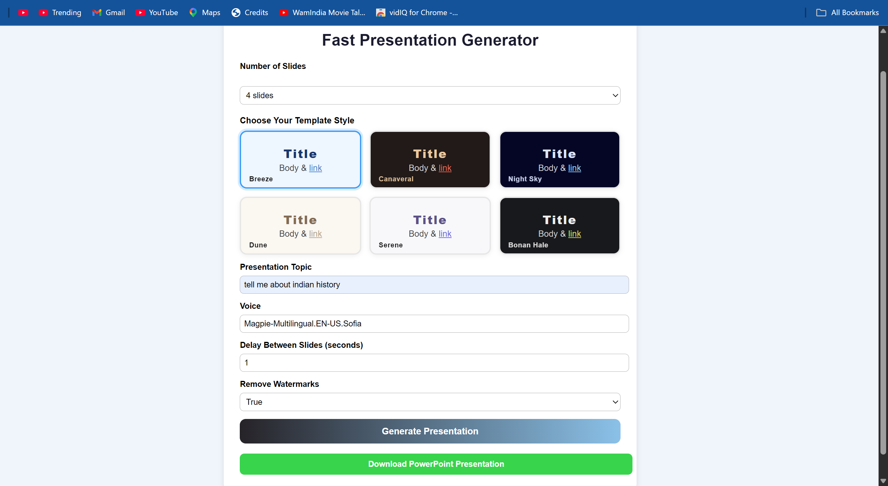
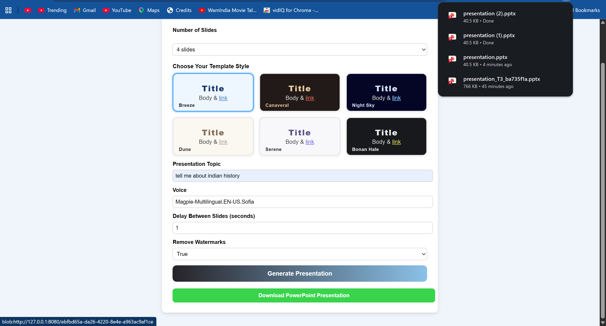
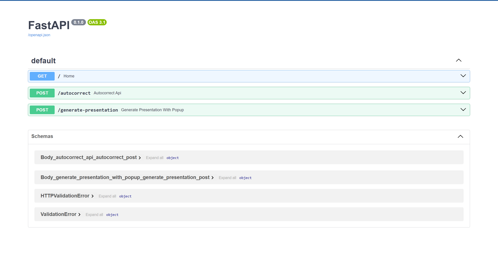

# Fast Presentation Generator

## Overview

Fast Presentation Generator is an AI-powered PowerPoint presentation generation system built using FastAPI, Python-PPTX, JavaScript, and NVIDIA Llama 3.1.

The application automatically generates professional PowerPoint presentations from a user-provided topic. It supports multiple presentation templates, AI-generated slide content, automatic spell correction, and direct PowerPoint (.pptx) download.

This project was developed in October 2025 as a personal learning project to explore AI-powered content generation, FastAPI backend development, and PowerPoint automation.

---

## Features

### AI-Powered Content Generation

* Generate presentation content automatically using NVIDIA Llama 3.1
* Professional slide titles and bullet points
* Topic-based presentation structure

### Presentation Generation

* Automatic PowerPoint (.pptx) creation
* Multiple presentation templates
* Dynamic slide generation
* Professional formatting

### Spell Correction System

* Automatic spelling correction
* Custom dictionary support
* Technical keyword protection

### User Interface

* Simple and responsive frontend
* Template selection
* Custom slide count selection
* One-click presentation download

### API Support

* FastAPI-based backend
* REST API architecture
* Swagger API documentation

---

## Technology Stack

| Technology       | Purpose               |
| ---------------- | --------------------- |
| Python           | Backend Development   |
| FastAPI          | API Framework         |
| JavaScript       | Frontend Logic        |
| HTML5            | User Interface        |
| CSS3             | Styling               |
| Python-PPTX      | PowerPoint Generation |
| NVIDIA Llama 3.1 | AI Content Generation |
| PySpellChecker   | Spell Correction      |
| Uvicorn          | ASGI Server           |

---

## Project Structure

```text
PPT-GENERATOR/
│
├── app/
│   ├── api/
│   ├── core/
│   ├── services/
│   ├── templates/
│   ├── __init__.py
│   └── main.py
│
├── frontend/
│   ├── index.html
│   ├── main.js
│
├── screenshots/
│   ├── home-page.png
│   ├── template-selection.png
│   └── swagger-api.png
│
├── .env.example
├── .gitignore
├── Dockerfile
├── requirements.txt
└── README.md
```

---

## Installation

### Clone Repository

```bash
git clone https://github.com/your-username/Fast-Presentation-Generator.git
```

### Navigate to Project Directory

```bash
cd Fast-Presentation-Generator
```

### Create Virtual Environment

```bash
python -m venv venv
```

### Activate Environment

Windows:

```bash
venv\Scripts\activate
```

### Install Dependencies

```bash
pip install -r requirements.txt
```

### Configure Environment Variables

Create a `.env` file:

```env
NVIDIA_API_KEY=your_api_key_here
```

### Run Backend

```bash
uvicorn app.main:app --reload --port 8000
```

### Run Frontend

Open a second terminal:

```bash
cd frontend
python -m http.server 8080
```

Open:

```text
http://127.0.0.1:8080
```

---

## Screenshots

### Home Page



### Template Selection



### API Documentation



---

## API Documentation

After starting the backend, API documentation is available at:

```text
http://127.0.0.1:8000/docs
```

Available endpoints:

* GET /
* POST /autocorrect
* POST /generate-presentation

---

## Learning Outcomes

This project helped me gain practical experience in:

* FastAPI Development
* REST API Design
* AI Integration with NVIDIA LLMs
* PowerPoint Automation
* Prompt Engineering
* Python Application Architecture
* Frontend and Backend Integration
* Environment Variable Management
* Git and GitHub Workflow

---

## Future Enhancements

* PDF Export Support
* User Authentication
* Cloud Deployment
* Additional Presentation Templates
* Image Generation for Slides
* Presentation Theme Customization
* Export Analytics

---

## Author

### Vineet Kushwaha

Python Developer | AI & ML Enthusiast

GitHub: https://github.com/vineetkushwaha8858

Personal Learning Project (October 2025)
